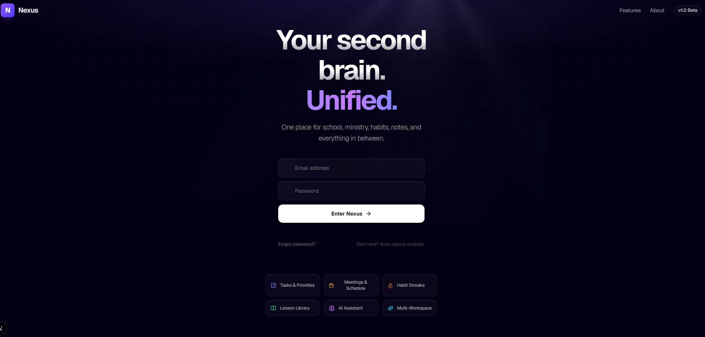
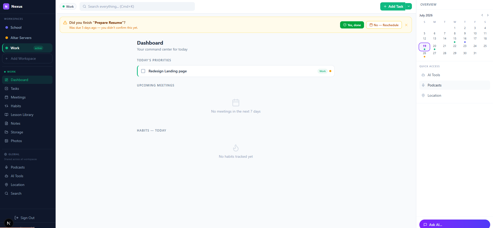

# 🧠 Nexus: Your Second Brain, Unified

**Nexus** is a personal productivity web app designed to unify multiple life contexts specifically School and Ministry into one seamless command center. It uses a unique **Workspace** architecture to keep data separable while sharing features, ensuring that tasks, meetings, and habits never overlap or get lost.



## ✨ Key Features

- **Multi-Workspace Architecture:** Switch between School, Ministry, Work, and Personal contexts instantly. Data is strictly scoped to the active workspace.
- **Accountability Banner:** Automatically detects overdue, unconfirmed tasks and prompts you to either mark them as done or reschedule them.
- **Intersecting Mini-Calendar:** A unified calendar view that visually intersects events and tasks from ALL active workspaces using color-coded dots.
- **AI Secretary (Gemini Powered):** An AI assistant that doesn't just chat—it acts as a secretary. It can suggest rescheduling missed tasks, analyze calendar conflicts, and draft meeting agendas based on your active workspace context.
- **Secure & Private:** Built with Supabase Auth and strict Row Level Security (RLS) policies. Your data is 100% isolated to your user ID.




## ️ Tech Stack

- **Frontend:** Next.js 15 (App Router), TypeScript, Tailwind CSS, shadcn/ui (Radix UI)
- **Backend & Database:** Supabase (PostgreSQL), Row Level Security (RLS)
- **AI Integration:** Google Gemini API (`gemini-2.5-flash`) via `@google/generative-ai`
- **Deployment Target:** Vercel

##  Installation & Setup

Follow these steps to get Nexus running locally on your machine.

### 1. Prerequisites
Before you begin, ensure you have the following:
- [Node.js](https://nodejs.org/) (v18 or higher) installed.
- A free [Supabase](https://supabase.com/) project.
- A free [Google AI Studio](https://aistudio.google.com/app/apikey) API key.

### 2. Clone the Repository
```bash
git clone https://github.com/YOUR_USERNAME/nexus.git
cd nexus