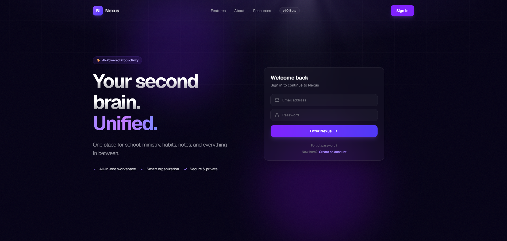
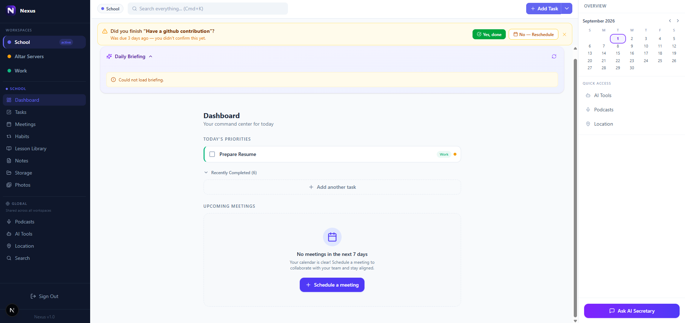

# 🧠 Nexus: Your Second Brain, Unified

**Nexus** is a personal productivity web app designed to unify multiple life contexts—specifically School and Ministry—into one seamless command center. It uses a unique **Workspace** architecture to keep data strictly separable while sharing core features, ensuring that tasks, meetings, and habits never overlap or get lost.



## ✨ Key Features

- **Multi-Workspace Architecture:** Switch between School, Ministry, Work, and Personal contexts instantly. Data is strictly scoped to the active workspace.
- **Accountability Banner:** Automatically detects overdue, unconfirmed tasks and prompts you to either mark them as done or reschedule them intelligently.
- **Intersecting Mini-Calendar:** A unified calendar view that visually intersects events and tasks from ALL active workspaces using color-coded dots.
- **AI Secretary (Groq Powered):** An AI assistant that doesn't just chat—it acts. It parses natural language to automatically create meetings, suggest rescheduling for missed tasks, and analyze calendar conflicts based on your active workspace context.
- **Secure & Private:** Built with Supabase Auth and strict Row Level Security (RLS) policies. Your data is 100% isolated to your user ID.



## 🛠️ Tech Stack

- **Frontend:** Next.js 15 (App Router), React 19, TypeScript, Tailwind CSS, shadcn/ui, Framer Motion
- **Backend & Database:** Supabase (PostgreSQL, Auth), Row Level Security (RLS)
- **AI Integration:** Groq API (`llama-3.3-70b-versatile`) via `groq-sdk`
- **Package Manager:** pnpm
- **Deployment:** Vercel (CI/CD, Preview Deployments)

## 🔒 Security & Architecture
Nexus was built with a **backend-first approach**:
1. Database schema and Row Level Security (RLS) policies were defined before any frontend code was written.
2. Authentication state is managed securely using `@supabase/ssr` with Next.js 15's asynchronous cookie handling.
3. Middleware is optimized to be cookie-only (no database queries), ensuring sub-millisecond routing checks and lightning-fast page loads.

## 🚀 Installation & Setup

Follow these steps to get Nexus running locally on your machine.

### 1. Prerequisites
Before you begin, ensure you have the following:
- [Node.js](https://nodejs.org/) (v18 or higher) installed.
- [pnpm](https://pnpm.io/) installed (`npm install -g pnpm`).
- A free [Supabase](https://supabase.com/) project.
- A free [Groq](https://console.groq.com/keys) API key.

### 2. Clone the Repository
```bash
git clone https://github.com/Vincent-MV/workplace-app.git
cd workplace-app